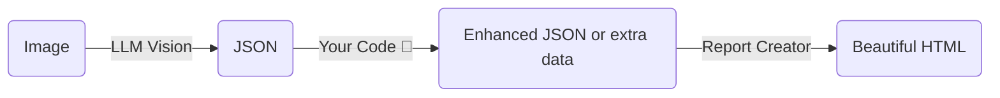

# 🦖 **RAWR Agent – _Read And Write Report_**  
*A starter workflow template for [NVIDIA AIQ Toolkit](https://github.com/NVIDIA/AIQToolkit) by **Jeremy K** & **Daren Ace***

> **TL;DR** Point the agent at an image (URL or local file) → ask your preferred LLM to extract structured JSON → pipe that JSON into **Report Creator** templates → instantly get a polished, single‑file HTML report.

---

## 🌟 What’s inside?

| Feature | Details |
|---------|---------|
| **Image → JSON** | Uses an LLM (default: `build.nvidia.com`, easily swappable for OpenAI, etc.) to “look” at an image and answer with JSON. |
| **Template‑driven reports** | **Report Creator** renders the JSON into eye‑catching HTML via the templates in `report_templates/`. |
| **One‑call flexibility** | Pick any template just by passing its name as a function‑call parameter—perfect for multiple report types. |
| **Batteries included** | Comes with a minimal but complete [AIQ](https://github.com/NVIDIA/AIQToolkit) workflow (server + UI) so you can extend the logic between “read” and “write.” |

---

## 🦕 Getting Started

> _Assumes you already have Python 3.9 + and `uv` or `pip` handy._

1. **Install AIQToolkit**  
   ```bash
   pip install aiqtoolkit
   # or follow the official guide:
   # https://docs.nvidia.com/aiqtoolkit/latest/quick-start/installing.html
   ```

2. **Clone or copy this workflow**  
   ```bash
   cd <your‑projects‑dir>
   git clone https://github.com/<you>/rawr_agent.git
   mkdir -p ~/.aiqtoolkit/workflows
   cp -r rawr_agent ~/.aiqtoolkit/workflows/
   ```

3. **Editable install (so code changes hot‑reload)**  
   ```bash
   cd ~/.aiqtoolkit/workflows/rawr_agent
   uv pip install -e .
   ```

4. **Launch the workflow server**  
   ```bash
   aiq serve --config_file configs/config.yml
   ```

5. **Launch the AIQ UI in a separate terminal**  
   ```bash
   aiq ui
   # Ref: https://docs.nvidia.com/aiqtoolkit/latest/quick-start/launching-ui.html
   ```

6. **Open your browser at** <http://localhost:3000>  
   *Start chatting; watch the server terminals for logs/errors.*

7. **Go RAWR in the jungle**  
   Point the agent at any image and enjoy the auto‑generated reports in `report_exports/` (self‑contained interactive HTML).

---

## 📸 Screenshots

| Prompting in NVIDIA UI | Generated HTML Report |
|------------------------|-----------------------|
| _<screenshot placeholder>_ | _<screenshot placeholder>_ |

> _Drop your own screenshots in `/docs/img/` and update the table!_

---

## 🧩 Template System

Reports are powered by **[Report Creator](https://report-creator.readthedocs.io/en/latest/api.html)** by Daren Ace.  
Create new templates in `report_templates/` and call them by name—no code changes required.

---

## 🏗️ Build Your Own RAWR

This repo is deliberately minimal. Insert your own logic between **read** (LLM vision) and **write** (HTML report):



---

## 🌋 Contributing / Issues

It’s a public repo—PRs & issues are welcome! Let’s make this starter template an **even bigger dinosaur**.

> “Ah, now eventually you do plan to have dinosaurs on your, on your dinosaur tour, right? Hello?” — **Dr. Ian Malcolm**

---

## 📄 License

Distributed under the **MIT License**. See `LICENSE` for more information.