# 🦖 **RAWR Agent – _Read And Write Report_**  
*A starter workflow template for [NVIDIA AIQ Toolkit](https://github.com/NVIDIA/AIQToolkit) by **Jeremy Kesten** 

> **TL;DR** Access the Nvidia AgentIQ chat UI locally, to prompt an agent to look at an image (URL or local file) → the first agent tool asks your preferred vision enabled LLM to extract structured JSON → a second agent tool function converts the JSON into **Report Creator** (https://github.com/darenr/report_creator) templates → instantly get a polished, single‑file HTML report.

---

## 🌟 What’s inside?

| Feature | Details |
|---------|---------|
| **Image → JSON** | Uses a vision enabled LLM (default: `build.nvidia.com`, easily swappable for OpenAI, etc.) to “look” at an image and answer with JSON. Also includes example scripts for running a PaddleOCR NIM docker container, for more sensitive applications, where an external LLM is not possible.|
| **Template‑driven reports** | **Report Creator** renders the JSON into eye‑catching HTML via the templates in `report_templates/`. |
| **One‑call flexibility** | For multiple report types, you can pick any custom pre-setup template just by passing its name in a single function‑call parameter. |
| **Batteries included** | Works as a complete [AIQ](https://github.com/NVIDIA/AIQToolkit) workflow, built to be a scaffolding so you can extend the logic between llm “read” and report “write.”  |

---

## 🦕 Getting Started

1. **Download AIQToolkit**
   ```bash
   mkdir -p ~/<your‑AIQtoolkit‑dir>
   git clone https://github.com/NVIDIA/AIQToolkit
   #  for local dev we install in WSL in ~/aiqtoolkit 
   ```

2. **Clone or fork this AgentIQ Workflow**  
   ```bash
   cd <your‑AIQtoolkit‑dir>
   mkdir -p ~/<your‑AIQtoolkit‑dir>/workflows
   cd workflows
   git clone https://github.com/jeremykpark/rawr_agent.git
   ```

> _Assumes you already have Python 3.9 + and `uv` or `pip` handy._

3. **Install AIQToolkit**  
   ```bash
   Create a new .venv environment and Install AIQTOOLKIT
   #  follow the official AIQToolkit setup guide :
   #  https://docs.nvidia.com/aiqtoolkit/latest/quick-start/installing.html
   ```

4. **Register this workflow with AIQ**  
   ```bash
   cd ~/<your‑AIQtoolkit‑dir>/workflows/rawr_agent
   uv pip install -e .


5. **Launch the workflow server from the workflow root dir**  
   ```bash
    cd ~/<your‑AIQtoolkit‑dir>/workflows/rawr_agent
   aiq serve --config_file configs/config.yml
   ```

6. **Launch the AIQ UI in a separate terminal**  
   ```bash
   cd ~/<your‑AIQtoolkit‑dir>/external/aiqtoolkit-opensource-ui
   npm dev start

   # follow the official AIQ UI setup guide first - NPM version v18.17.0 or new required:
   # Ref: https://docs.nvidia.com/aiqtoolkit/latest/quick-start/launching-ui.html
   ```

7. **Open your browser at** <http://localhost:3000>  
   *Start chatting - test with one of the prompts in README_prompt_suggestions.md; watch the server terminals for logs/errors.*

8. **Go RAWR in the jungle**  
   *Point the agent at any image and enjoy the auto‑generated reports in `report_exports/` (self‑contained interactive HTML).*

---

## 🖼️ Sample Flyer Included

The default setup is to read this included sample file and create a report on the data inside.


---

## 🧩 Template System

Reports are powered by **[Report Creator](https://report-creator.readthedocs.io/en/latest/api.html)** by Daren Ace.  
Create new templates in `report_templates/`. Set them up in rawr_report_template.py to call them by name.
Generated reports are saved to /report_exports as an HTML file.

---

## 🏗️ Build Your Own RAWR

This repo is deliberately minimal and is to be used as scaffolding for your own projects. Insert your own logic between **read** (LLM vision) and **write** (HTML report):

```mermaid
graph LR
  A(Image) -->|LLM Vision| B(JSON)
  B -->|Your Code 🤖| C(Enhanced JSON or extra data)
  C -->|Report Creator| D(Beautiful HTML)
```



---

## 🌋 Contributing / Issues

It’s a public repo—PRs & issues are welcome! Let’s make this starter template an **even louder RAWR**.

> “Ah, now eventually you do plan to have dinosaurs on your, on your dinosaur tour, right? Hello?” — **Dr. Ian Malcolm**

---

## 📄 License

Distributed under the **MIT License**. See `LICENSE` for more information.